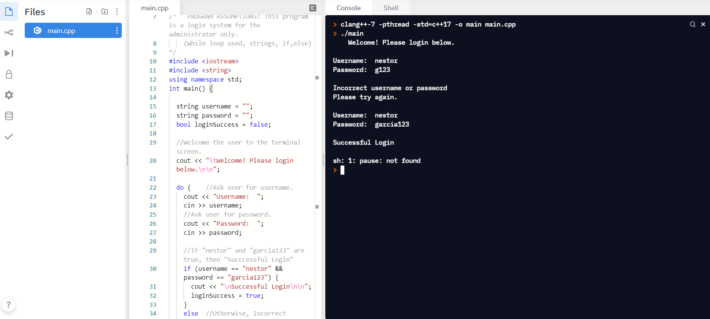

<h2>SimpleLogin</h2>
<h3><ul><li>C++</ul></li>

 
--------------------------------------------------------------------------------------------------------------
 
 This program is a login system for the administrator only. (While loop used, strings, if,else) This is a work in progress that I have.   The goals for this project are to apply this code to one of my future projects.

 Ask user for username
If "nestor" and "garcia123" are true, then "Succcessful Login".
 
 

 

 <b>Nestor Garcia</b>

